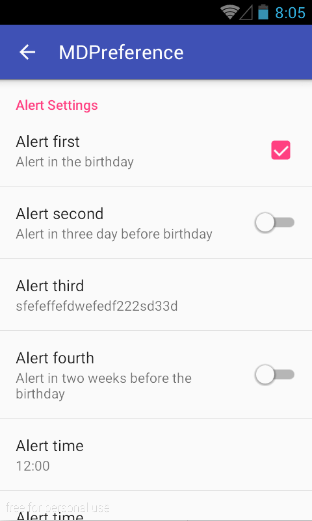

# MDPreference
[](https://github.com/XhinLiang/MDPreference)
[](https://jitpack.io/#XhinLiang/MDPreference)
[](http://www.apache.org/licenses/LICENSE-2.0)

## Introduce
Group of Preference, just like the Preference of original Android.

Easy to use and good effect in pre-Lollipop.

## Sample


## Import

### Gradle
**1. Add it in your root build.gradle at the end of repositories**

```
allprojects {
	repositories {
		...
		maven { url "https://jitpack.io" }
	}
}
```
**2. Add the dependency**

```
dependencies {
	compile 'com.github.XhinLiang:MDPreference:0.1.0'
}
```
### Maven
**1. Add the JitPack repository to your build file**
```
<repositories>
	<repository>
		<id>jitpack.io</id>
		<url>https://jitpack.io</url>
	</repository>
</repositories>
```
**2. Add the dependency**

```
<dependency>
	<groupId>com.github.XhinLiang</groupId>
	<artifactId>MDPreference</artifactId>
	<version>0.1.0</version>
</dependency>
```

## Usage

#### define the xml of PreferenceFragment in "../res/xml/your_xml_name.xml"
```
<?xml version="1.0" encoding="utf-8"?>
<PreferenceScreen xmlns:android="http://schemas.android.com/apk/res/android"
    xmlns:app="http://schemas.android.com/apk/res-auto">
    <io.github.xhinliang.mdpreference.PreferenceCategory android:title="Alert Settings">
        <io.github.xhinliang.mdpreference.CheckBoxPreference
            android:key="preference_key_remind_the_same_day1"
            android:summary="Alert in the birthday"
            android:title="Alert first" />
        <io.github.xhinliang.mdpreference.SwitchPreference
            android:key="preference_key_remind_the_same_day3"
            android:summary="Alert in three day before birthday"
            android:title="Alert second" />
        <io.github.xhinliang.mdpreference.EditTextPreference
            android:key="preference_key_remind_the_same_daywwwd2"
            android:summary="Alert in a week before the birthday"
            android:title="Alert third" />
        <io.github.xhinliang.mdpreference.SwitchPreference
            android:key="preference_key_remind_the_same_day34"
            android:summary="Alert in two weeks before the birthday"
            android:title="Alert fourth" />
        <io.github.xhinliang.mdpreference.ListPreference
            android:key="preference_key_alert_timess"
            android:summary="Select alert time"
            android:title="Alert time"
            app:entry_arr="@array/alert_time_entry"
            app:format_str="%s"
            app:value_arr="@array/alert_time_value" />
        <io.github.xhinliang.mdpreference.MultiSelectListPreference
            android:key="preference_key_alert_timeddwexss"
            android:summary="Select alert time"
            android:title="Alert time"
            app:entry_arr="@array/alert_time_entry"/>
    </io.github.xhinliang.mdpreference.PreferenceCategory>
</PreferenceScreen>
```
#### Create your SettingsFragment which extends io.github.xhinliang.mdpreference.PreferenceFragment
``` java
public class SettingsFragment extends PreferenceFragment {
    @Override
    public void onCreate(Bundle savedInstanceState) {
        super.onCreate(savedInstanceState);
        getPreferenceManager().setSharedPreferencesName(getString(R.string.app_name));
        addPreferencesFromResource(R.xml.preference_settings);
    }
}
```

## Notice
- There are lots of Class in the package corresponding to the original Android
 - Preference
 - EditTextPreference
 - ListPreference
 - MultiSelectListPreference
 - PreferenceCategory
 - PreferenceFragment
 - SwitchPreference

- For **most** of Preference, you can use them just like original Android Preference.

- For **ListPreference** you should use like this
```
  <io.github.xhinliang.mdpreference.ListPreference
        android:key="preference_key_alert_timess"
        android:summary="Select alert time"
        android:title="Alert time"
        app:entry_arr="@array/alert_time_entry"
        app:format_str="%s"
        app:value_arr="@array/alert_time_value" />
```
The **entry_arr** is the array for entry and the **value_arr** is the array for the value you can get like this
``` java
listPreference.getValue();
```

The **format_str** is the format String for the summary, the **%s** is for the selected entry.

- For **MultiSelectListPreference** you should use like this
```
 <io.github.xhinliang.mdpreference.MultiSelectListPreference
        android:key="preference_key_alert_timeddwexss"
        android:summary="Select alert time"
        android:title="Alert time"
        app:entry_arr="@array/alert_time_entry"/>
```
The **entry_arr** is the array for entry.
You can get the array of selected Integer like this
``` java
multiSelectListPreference.getIndexes();
```

## More
- XhinLiang@gmail.com
- [Blog](http://xhinliang.github.io)

## Thanks
- [Android-MaterialPreference](https://github.com/jenzz/Android-MaterialPreference)
- [material-ripple](https://github.com/balysv/material-ripple)
- [material](https://github.com/rey5137/material)

## License

    Copyright 2016 XhinLiang
    Copyright 2014 rey5137
    Copyright 2015 balysv

    Licensed under the Apache License, Version 2.0 (the "License");
    you may not use this file except in compliance with the License.
    You may obtain a copy of the License at

       http://www.apache.org/licenses/LICENSE-2.0

    Unless required by applicable law or agreed to in writing, software
    distributed under the License is distributed on an "AS IS" BASIS,
    WITHOUT WARRANTIES OR CONDITIONS OF ANY KIND, either express or implied.
    See the License for the specific language governing permissions and
    limitations under the License.

